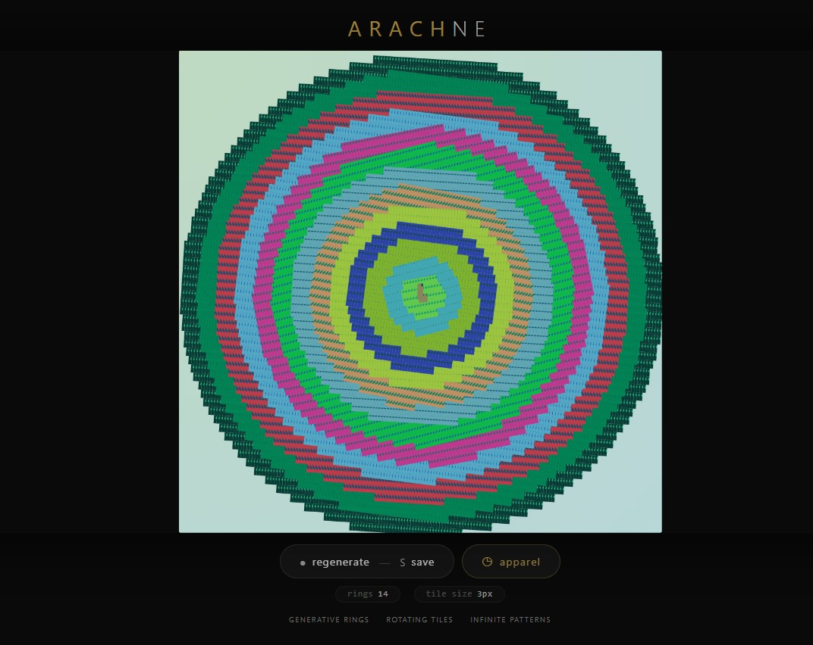
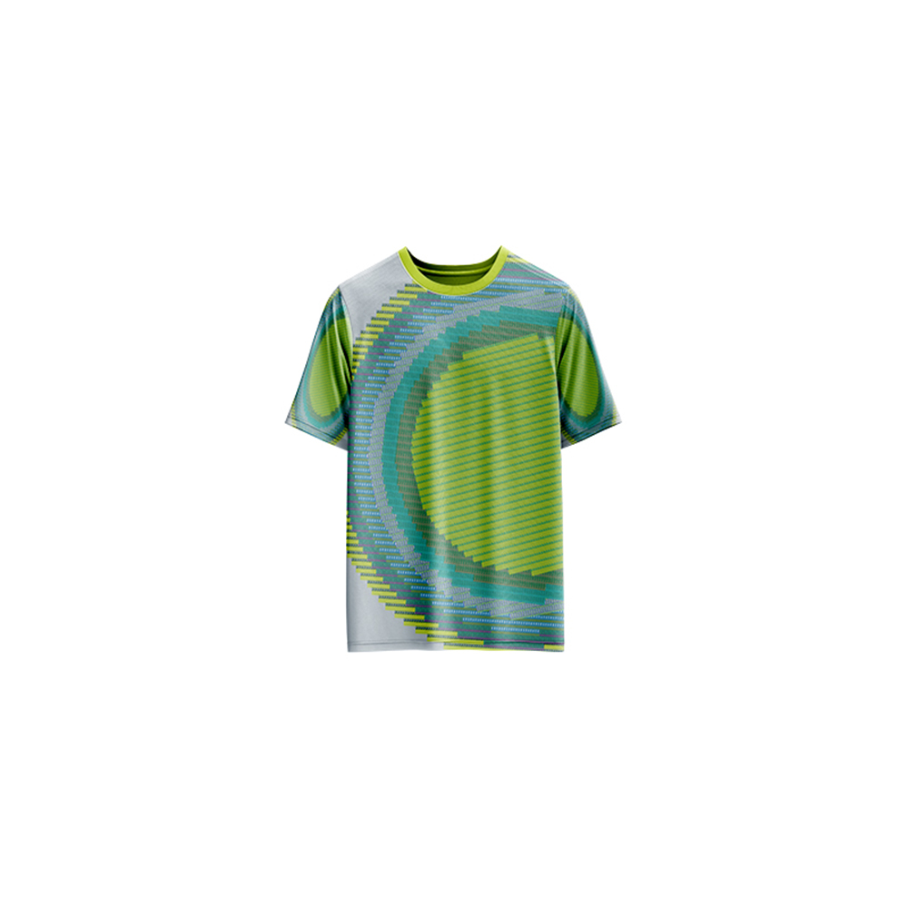

# Arachne — Generative Art

[](https://reyrove.github.io/Arachne-Generative-Art)
[](https://opensource.org/licenses/MIT)

> **Generative ring art with rotating geometric tiles.** Each refresh creates a unique composition of concentric rings filled with tiled geometric patterns, resembling a spider's web of abstract shapes.

## 🎨 Live Demo

<div align="center">
  <a href="https://reyrove.github.io/Arachne-Generative-Art" target="_blank">
    
  </a>
  <br><br>
  <a href="https://reyrove.github.io/Arachne-Generative-Art" target="_blank">
    
  </a>
  <br>
  <em>Click the image or button to experience the generative art</em>
</div>

## 👕 Apparel Preview

<div align="center">
  
  <br>
  <em>Arachne artwork printed on a T-shirt</em>
</div>

## ✨ Features

- **Concentric Rings** — 5-15 rings radiating from the center
- **Rotating Tiles** — Each ring rotates at a different speed
- **Geometric Patterns** — Lines and shapes tiled in circular patterns
- **Gradient Background** — Smooth diagonal gradient behind the rings
- **Random Colors** — Unique color palettes for each generation
- **Save & Share** — Download as PNG
- **Apparel Mode** — Preview artwork on a T-shirt mockup
- **Responsive** — Works on desktop, tablet, and mobile
- **p5.js Powered** — Built with the creative coding library
- **Keyboard Shortcuts**:
  - `R` — Regenerate
  - `S` — Save image
  - `T` — Toggle apparel view
  - `Space` — Regenerate

## 🎨 Artwork Details

| Parameter | Range | Description |
|-----------|-------|-------------|
| **Rings** | 5–15 | Number of concentric rings |
| **Tile Size** | Variable | Each tile is a small geometric unit |
| **Rotation Speed** | -5 to 5 | Each ring rotates at a different speed |
| **Colors** | Random | Unique palettes per generation |

## 🎯 Visual Elements

### Concentric Rings
- Rings radiate from the center outward
- Each ring has a unique rotation speed
- Creates dynamic, layered compositions

### Geometric Tiles
- Small rectangular tiles arranged in circles
- Each tile contains random lines and shapes
- Tiles are densely packed for intricate patterns

### Gradient Background
- Soft diagonal gradient behind the rings
- Warm or cool color palettes
- Provides depth and contrast

### Pattern Generation
- Each tile is uniquely generated
- Random lines and shapes inside each tile
- Creates rich, organic textures

## 🚀 Quick Start

### Local Development

```bash
# Clone the repository
git clone https://github.com/reyrove/Arachne-Generative-Art.git

# Navigate to the directory
cd Arachne-Generative-Art

# Open in browser
open index.html
# or use a live server
```

### Deploy to GitHub Pages

1. Push to GitHub
2. Go to Settings → Pages
3. Select branch `main` and root folder
4. Your site will be live at `https://reyrove.github.io/Arachne-Generative-Art`

## 🧠 How It Works

The artwork creates intricate ring patterns using a tile-based approach:

1. **Setup**:
   - Random gradient background
   - Random number of rings (5–15)
   - Each ring gets a unique tile size and rotation speed

2. **Tile Generation**:
   - Each ring creates a small graphic tile
   - Tiles contain random lines and shapes
   - Tiles are repeated in a circular pattern

3. **Rendering**:
   - Rings are drawn from largest to smallest
   - Each ring rotates at its own speed
   - Tiles fill the circular area of each ring

4. **Composition**:
   - Creates a web-like pattern
   - Similar to a spider's web (Arachne)
   - Intricate and mesmerizing

## 📁 File Structure

```
Arachne-Generative-Art/
├── index.html          # Main application (all-in-one)
├── Arachne.jpg         # T-shirt mockup image
├── fav.svg             # Favicon
├── demo-screenshot.jpg # Website demo screenshot
├── README.md           # This file
└── LICENSE             # MIT License
```

## 🛠️ Tech Stack

- **p5.js** — Creative coding library
- **Canvas API** — 2D rendering with gradients
- **CSS Flexbox/Grid** — Responsive layout
- **GitHub Pages** — Hosting

## 🎯 Interactive Controls

| Action | Keyboard | Button |
|--------|----------|--------|
| Regenerate | `R` or `Space` | Click "regenerate" |
| Save Image | `S` | Click "regenerate" |
| Toggle Apparel | `T` | Click "apparel" |

## 🎨 The Creative Process

### Inspired by Arachne
The artwork is named after Arachne, the weaver from Greek mythology who was transformed into a spider. Like a spider's web, the concentric rings and geometric patterns create an intricate, woven appearance.

### Tile-Based Architecture
Each ring is built from small tiles that repeat around the circle. The tiles contain random lines and shapes, creating complex patterns from simple building blocks.

### Dynamic Rotation
Each ring rotates at a different speed, creating a sense of motion and depth. The varying speeds produce interference patterns that make the artwork feel alive.

## 📱 Responsive Design

The application automatically adapts to:
- Desktop screens
- Tablets
- Mobile phones
- Landscape orientation
- Various aspect ratios
- Small screens (down to 380px wide)

## 🤝 Contributing

Contributions are welcome! Feel free to:
- Fork the repository
- Create a feature branch
- Submit a pull request

### Ideas for Contributions:
- Additional ring patterns
- New tile designs
- Interactive controls
- Color palette presets
- Animation features
- More apparel mockups

## 📄 License

MIT License — see [LICENSE](LICENSE) file for details.

## 🙏 Acknowledgments

- Created with p5.js
- Inspired by spider webs and Greek mythology
- Special thanks to the creative coding community

---

**Built with ❤️ and woven dreams**